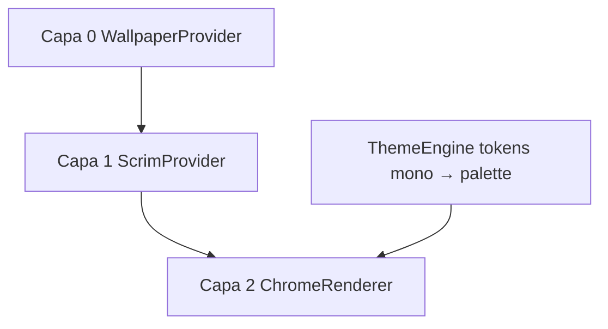

# Sistema de capas — wallpaper + outline contrastado

> **Estado:** draft — pendiente aprobación  
> **Módulo:** UI (`documentacion/ui/`) — no mezclar con SFTP/pandas

---

## 1. Visión

La app tiene un **fondo visual** (wallpaper, modificable) y encima un **manejador de UI** reducido a:

- **Tipografía** (labels, inputs, tablas)
- **Bordes sólidos** (1–2 px, sin gradientes ni sombras en fase 1)
- **Sin rellenos** en paneles (transparente) salvo scrim global

Objetivo: prototipar en **negro y blanco**; luego aplicar **paletas** cambiando tokens, no rehaciendo layouts.

---

## 2. Modelo de capas

```text
┌─────────────────────────────────────────────┐
│  Capa 2 — Chrome (texto + bordes)           │  ← reacciona al contraste
│  ┌─────────┐  ┌──────────────────────────┐  │
│  │ outline │  │ outline table / preview  │  │
│  └─────────┘  └──────────────────────────┘  │
├─────────────────────────────────────────────┤
│  Capa 1 — Scrim (overlay uniforme)          │  ← opcional; estabiliza contraste
│  rgba(0,0,0,0.45) o rgba(255,255,255,0.35)│
├─────────────────────────────────────────────┤
│  Capa 0 — Wallpaper (imagen full-bleed)     │  ← modificable por usuario/perfil
└─────────────────────────────────────────────┘
```



---

## 3. Contraste — cómo “reaccionan” letras y bordes

### Opción A — Scrim + chrome fijo (recomendada fase 1)

| Modo | Scrim | Texto / bordes |
|------|-------|----------------|
| **dark-chrome** | Negro 40–55% opacidad | `#FFFFFF` |
| **light-chrome** | Blanco 35–50% opacidad | `#000000` |

El usuario (o perfil) elige modo **o** se auto-elige por luminancia media del wallpaper (Opción B).

**Pros:** legible siempre, barato, sin parpadeo al scroll.  
**Contras:** no “ve” el wallpaper al 100% bajo paneles (solo en márgenes).

### Opción B — Auto según wallpaper (fase 2)

1. Cargar imagen → calcular luminancia media (muestra o downscale 32×32)
2. Si `L > 0.5` → `light-chrome` (texto negro)
3. Si `L ≤ 0.5` → `dark-chrome` (texto blanco)

Misma regla para grosor de borde (opcional: borde más grueso en fondos ruidosos).

### Opción C — Muestreo por widget (no recomendada v1)

Sample bajo cada panel → cambia al mover ventana. Compleja y frágil en tablas SFTP.

**Decisión draft:** A en MVP → B cuando haya motor de tema estable.

---

## 4. Reglas visuales fase mono (B/N)

| Elemento | Regla |
|----------|--------|
| Paneles | `background: transparent`; `border: 2px solid var(--chrome-fg)` |
| Botones | Solo borde + label; hover = invertir (fg/bg swap) |
| Inputs | Borde sólido; fondo transparente o scrim-local muy sutil |
| Tabla SFTP | Líneas de grid sólidas; header con borde inferior grueso |
| Estados error | Borde doble o label `[ERROR]` — sin rojo hasta paleta |
| Focus | Borde 3px o dash — sin glow color |

Tokens en [`tokens-mono.base.yaml`](./tokens-mono.base.yaml).

---

## 5. Wallpaper modificable

### WallpaperProvider (contrato UI)

```text
get_path() -> Path | None
set_path(path: Path) -> None
get_fit() -> "cover" | "contain" | "tile"
get_blur() -> 0..N px (opcional fase 2)
reload() -> signal wallpaper_changed
```

### Fuentes

| Fuente | Uso |
|--------|-----|
| `ui/assets/wallpapers/default-mono.webp` | Bundle app |
| Ruta usuario en perfil JSON `ui.wallpaper_path` | Personalizado |
| Sin imagen | Color sólido `#1a1a1a` o `#f5f5f5` (mono) |

### Persistencia (perfil)

```json
"ui": {
  "wallpaper_path": "~/Pictures/pde-bg.jpg",
  "wallpaper_fit": "cover",
  "chrome_mode": "auto",
  "scrim_opacity": 0.48
}
```

Sección `ui` en perfil — **no** mezclar con `sftp` en documentación (`documentacion/ui/` vs `documentacion/sftp/`).

---

## 6. Paletas futuras (fase 3)

```text
tokens/base.yaml          → medidas, fonts, border-width
tokens/mono-dark.yaml     → --chrome-fg: #fff
tokens/mono-light.yaml    → --chrome-fg: #000
palettes/pde-brand.yaml   → --chrome-fg: #E8E8E8; --accent: #0066CC
```

`ThemeEngine.load(palette_name)` regenera stylesheet. **Wallpaper no cambia**; solo tokens de chrome.

---

## 7. Funcionalidades UI nuevas (IDs borrador)

| ID | Funcionalidad |
|----|---------------|
| **U-20** | Capa wallpaper configurable |
| **U-21** | Scrim + modo chrome dark/light/auto |
| **U-22** | Widgets outline (sin fill) |
| **U-23** | ThemeEngine mono → paletas |
| **U-24** | Contraste WCAG mínimo 4.5:1 texto (validación automática) |

---

## 8. Pantallas afectadas (wireframe mental)

Todas las U-01–U-06 comparten el mismo stack de capas:

1. **Conexión SFTP** — caja outline campos + botón test
2. **Explorador** — tabla grid líneas sólidas sobre wallpaper
3. **Preview** — panel monospace borde simple
4. **Llaves** — lista outline + fingerprint texto

El wallpaper unifica identidad; el chrome outline no compite con el fondo gracias al scrim.

---

## 9. Accesibilidad

- Ratio contraste texto/fondo efectivo ≥ **4.5:1** (WCAG AA)
- Con wallpaper ruidoso → subir `scrim_opacity` automáticamente si ratio falla
- Modo alto contraste: scrim 70% + borde 3px (token `a11y.high_contrast`)

---

## 10. Assets draft

| Asset | Ubicación propuesta |
|-------|---------------------|
| Wallpaper default B/N abstracto | `ui/assets/wallpapers/default-mono.webp` |
| Placeholder sin wallpaper | color sólido token `--wallpaper-fallback` |

Generar wallpaper: gradiente sutil gris + ruido ligero (no distrae del outline UI).

---

## 11. Pendiente aprobación

- [ ] Modo scrim default: dark-chrome vs light-chrome
- [ ] ¿Blur wallpaper permitido en v1?
- [ ] ¿Usuario sube JPG/PNG only o también SVG?

**Siguiente:** [infraestructura-ui-stack.md](./infraestructura-ui-stack.md)
